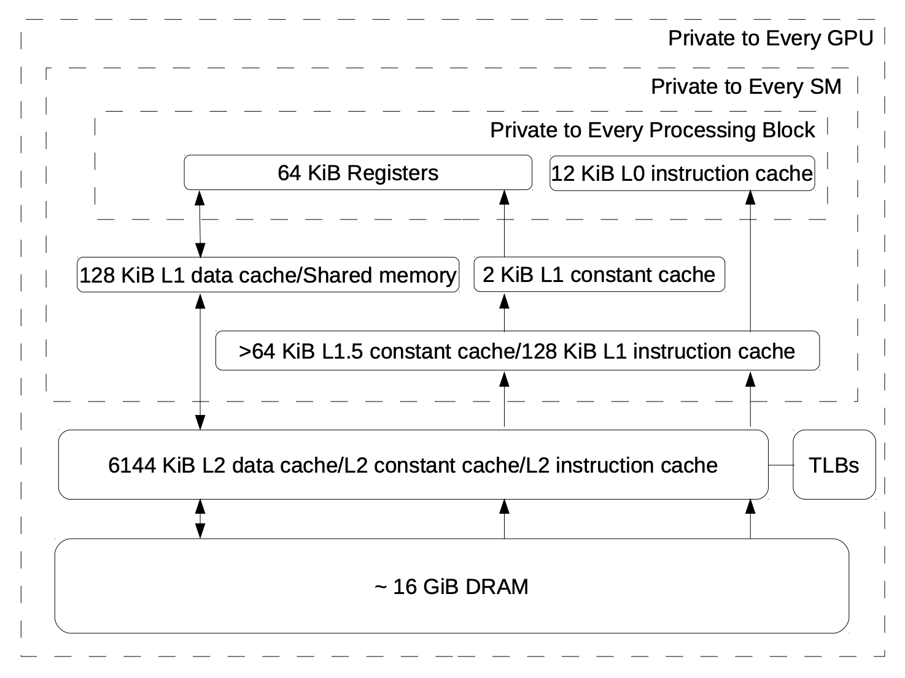

[How GPU Computing Works](https://www.nvidia.com/en-us/on-demand/session/gtcspring21-s31151/) and [How CUDA Programming Works](https://www.nvidia.com/en-us/on-demand/session/gtcspring22-s41487/)

The course [Programming Massively Parallel Processors](https://www.youtube.com/playlist?list=PLRRuQYjFhpmubuwx-w8X964ofVkW1T8O4)

 from [image in microprocessor-trend-data repository](https://github.com/karlrupp/microprocessor-trend-data/blob/master/50yrs/50-years-processor-trend.png)

[A100 Datasheet](https://www.nvidia.com/content/dam/en-zz/Solutions/Data-Center/a100/pdf/nvidia-a100-datasheet-nvidia-us-2188504-web.pdf)

```
                               |     A100 80GB PCIe    |     A100 80GB SXM
===============================+=======================+=======================
FP64                           |                   9.7 TFLOPS
FP64 Tensor Core               |                  19.5 TFLOPS
FP32                           |                  19.5 TFLOPS
Tensor Float 32 (TF32)         |            156 TFLOPS / 312 TFLOPS*
BFLOAT16 Tensor Core           |            312 TFLOPS / 624 TFLOPS*
FP16 Tensor Core               |            312 TFLOPS / 624 TFLOPS*
INT8 Tensor Core               |             624 TOPS / 1248 TOPS*
GPU Memory Bandwidth           |       1,935GB/s       |       2,039GB/s
Max Thermal Design Power (TDP) |          300W         |        400W***
Interconnect                   |  NVIDIA NVLink Bridge |    NVLink: 600GB/s
                               | for 2 GPUs: 600GB/s** |   PCIe Gen4: 64GB/s
                               |   PCIe Gen4: 64GB/s   |
===============================+=======================+=======================
* With sparsity
** SXM4 GPUs via HGX A100 server boards; PCIe GPUs via NVLink Bridge for up to two GPUs
*** 400W TDP for standard configuration. HGX A100-80GB CTS (Custom Thermal Solution) SKU can support TDPs up to 500W
```

 from [Dissecting the NVIDIA Volta GPU Architecture via Microbenchmarking](https://arxiv.org/abs/1804.06826)
